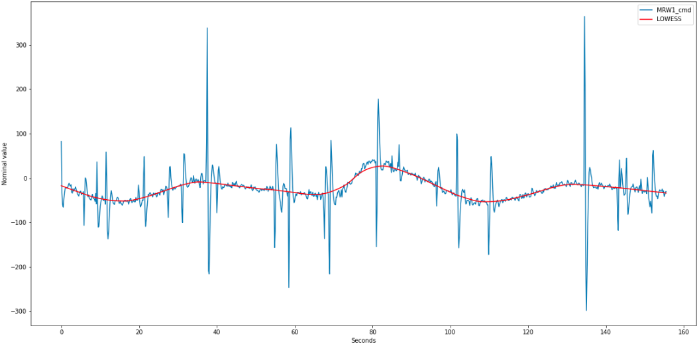
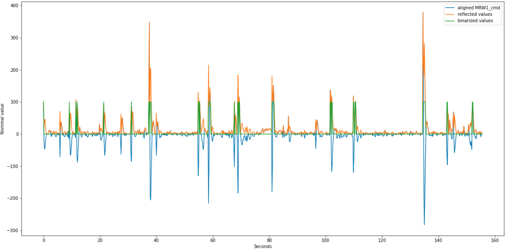
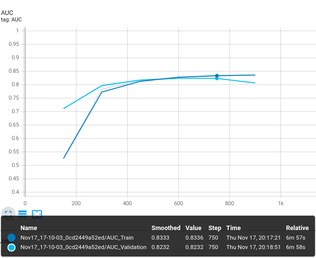
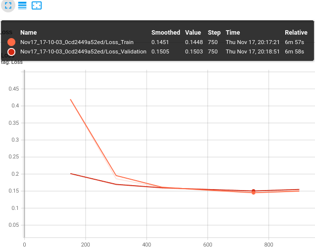

# Deep_Satellite_Telemetry_Tracing

*The project shows a particular solution of the tracing problem. 
The main goal is to propagate anomalies in satellite telemetry. 
There are a several of approaches to solve the problem, 
but the system reflects the case based on tracer implementation. 
The idea of applying the approach is inspired by the 
[article](https://stanford.edu/~cpiech/bio/papers/deepKnowledgeTracing.pdf).
The implementation of the tracer is based on the 
[project](https://github.com/seewoo5/KT)*

## Data preprocessing

Unfortunately, the real raw telemetry data cannot be displayed here due to 
security concerns. However, the `data.tar` file contains already 
preprocessed info to implement the tracing pipeline. 
In this case, the necessary information about the satellite 
system are angles, estimated and measured wheel velocities.
The components form a state vector, 
and in this vector we can find anomalies by component.

The key steps of the preprocessing are:
1. get LOWESS curve to align raw telemetry

2. get absolute values for quantile barrier application and binarization.

3. create representation of state vector in the tracing problem form.

## Results
Such a baseline is used by the telemetry of the on-board ARO system, 
which provides a solution to the same problem. 
According to the ROCAUC metrics, 
the ARO system quality is 54%, while the tracer quality is 82%.

